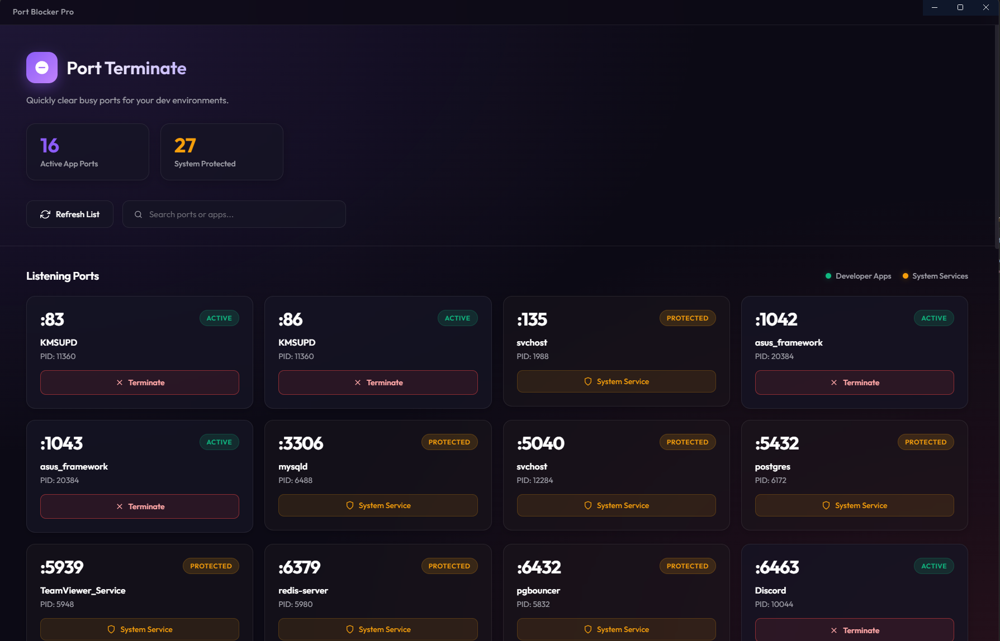

<div align="center">
  <h1>🚀 Port Terminate</h1>
  <p><b>A beautiful GUI to easily terminate ports without killing system processes.</b></p>
  <br>
  
</div>

<br>

<div align="center">

  
  
  
  

</div>

## 🌟 Why Port Terminate?

Ever encountered the dreaded `EADDRINUSE: address already in use` error while coding? **Port Terminate** (also known as Port Blocker Pro) gives you a sleek, lightning-fast GUI to view and terminate processes that are holding your precious development ports hostage—all while safely protecting critical system services!

## ✨ Key Features

- **🎨 Beautiful & Modern UI:** A stunning, dark-themed responsive interface with smooth micro-animations.
- **🛡️ System Protection:** Smartly distinguishes between developer apps (which you can kill) and essential system processes (which are protected from accidental termination).
- **⚡ Real-Time Port Scanning:** Automatically and continuously scans your network for active ports in the background.
- **🔍 Quick Search & Filter:** Instantly hunt down the exact port or process name you want to terminate.
- **🚀 One-Click Termination:** Free up any busy port with a single button press.

## 🛠️ Installation & Setup

1. **Clone the repository:**
   ```bash
   git clone https://github.com/GlaceYT/PortTerminate.git
   ```

2. **Navigate into the directory:**
   ```bash
   cd PortTerminate
   ```

3. **Install the dependencies:**
   ```bash
   npm install
   ```

4. **Launch the app!** 🚀
   ```bash
   npm start
   ```

*(Alternatively, run `npm run build` to compile the app into a standalone NSIS installer for Windows!)*

## 💻 Tech Stack

- **[Electron](https://www.electronjs.org/)** - For robust cross-platform desktop capabilities.
- **Vanilla HTML/CSS/JS** - Handcrafted with ❤️ for maximum performance and an exquisite UI.

## 🤝 Contributing

Contributions, issues, and feature requests are welcome! Feel free to check the [issues page](https://github.com/GlaceYT/PortTerminate/issues).

1. Fork the project.
2. Create your feature branch (`git checkout -b feature/AmazingFeature`).
3. Commit your changes (`git commit -m 'Add some AmazingFeature'`).
4. Push to the branch (`git push origin feature/AmazingFeature`).
5. Open a Pull Request.

## 📜 License

Distributed under the MIT License. See `LICENSE` for more information.

---
<div align="center">
  Made with ❤️ by <b><a href="https://github.com/GlaceYT">GlaceYT</a></b>
</div>
